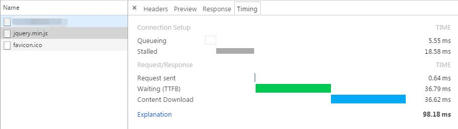
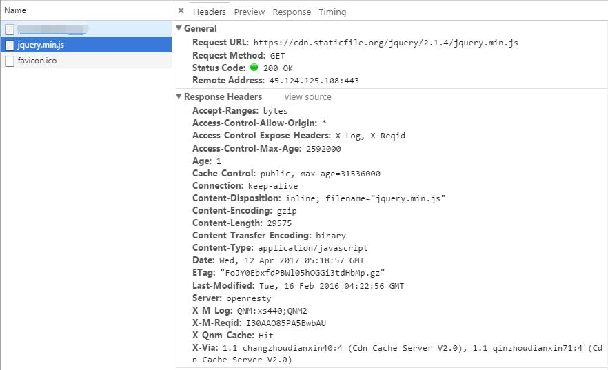
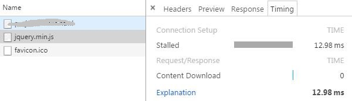
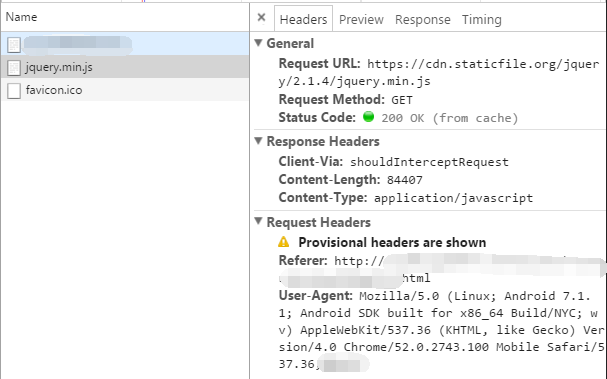

# JQuery加载优化 #

项目中有些页面用到了JQuery，但是每次都从cdn加载，从时间和流量的角度来讲，这样的方案并不是很好。

## cdn加载 ##
先在HTML在从CDN加载JQuery，查看其资源耗费情况：
```
<head>
    <script src="https://cdn.staticfile.org/jquery/2.1.4/jquery.min.js"></script>
</head>
```
通过debug，查看其耗时情况，截图如下：



从图中可以看出，其耗时近100ms.

再看其文件大小：

可以看到其通过gzip压缩后，content-length任然为29575Byte。

综上所述，这样的H5页面是比较糟糕的。因此，考虑从本地加载JQuery。

## 本地加载JQuery ##
JQuery是一个比较常用的JS框架，使用频率较高，因此如果能够从本地加载，就可以节省时间和流量。

首先需要说明的是：**HTML是从remote获取，而非local；而JQuery要从local获取**，（如果HTML、JS都是从local要简单一些）因此就出现了同源策略的限制问题。

### HTML from Remote & JS from Local ###
这个问题这么破？

其实方式有好几种：

1. 通过使用WebViewCient.shouldInterceptRequest方法来返回本地的资源
2. 在WebViewClient.onPageStarted方法中手动加载本地资源
3. 也有人自己实现FileProvider来实现(目前自己没有尝试，省略)

**解决方案详细说明**

 - 通过拦截加载JQuery

```Java
class CustomerWebClient extends WebViewClient{

        @Override
        public void onPageStarted(WebView view, String url, Bitmap favicon) {
            super.onPageStarted(view, url, favicon);
            //
        }

        @Override
        public WebResourceResponse shouldInterceptRequest(WebView view, WebResourceRequest request) {
            ...
                //拦截jquery加载，改为从本地加载
                if (request.getUrl().toString().contains("jquery")) {
                    WebResourceResponse response = new WebResourceResponse("application/javascript",
                            "UFT8",
                            ResourceUtils.getInSFromAssets(mContext, ResourceUtils.jquery_2_1_4));
                    return response;
                }
			...
            return super.shouldInterceptRequest(view, request);
        }
    }
```

 - 手动加载JQuery

WebViewClient.onPageStarted方法中调用以下的webViewLoadLocalJs方法进行加载。

```Java
    public static void webViewLoadLocalJs(WebView view, String path){
        String jsContent = assetFile2Str(view.getContext(), path);
        view.loadUrl("javascript:" + jsContent);
    }
	
	public static String assetFile2Str(Context c, String urlStr){
		InputStream in = null;
		try{
			in = c.getAssets().open(urlStr);
            BufferedReader bufferedReader = new BufferedReader(new InputStreamReader(in));
            String line = null;
            StringBuilder sb = new StringBuilder();
            do {
                line = bufferedReader.readLine();
                if (line != null && !line.matches("^\\s*\\/\\/.*")) {
                    sb.append(line);
                }
            } while (line != null);

            bufferedReader.close();
            in.close();
 
            return sb.toString();
		} catch (Exception e) {
			e.printStackTrace();
		} finally {
			if(in != null) {
				try {
					in.close();
				} catch (IOException e) {
				}
			}
		}
		return null;
	}
```

### 结果 ###
从本地加载JQuery的效果如何，请看下面的截图：、





结果很明显，流量那就是0，时间13ms，下载时间就是0。