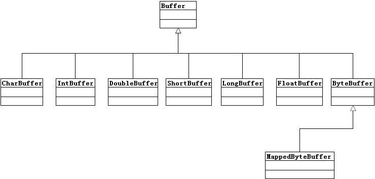

# Buffers
一个Buffer对象时固定数量的数据的容器。

Buffer的工作与Channel联系紧密

Channel是I/O传输发生时通过的入口

Buffer类图:


## 1. 缓冲区基础

数据存储方式：数组

数据内容和相关信息都在Buffer对象中


### 1.1 Buffer Attributes
 - int capacity  缓冲区大小
 - int limit    上界，缓冲区第一个不能被读写的元素
 - int position 下一个要被读写的元素索引
 - int mark 备忘位置

以上三个属性中capacity是在初始化时设置的，其后不能更改，其余三个可以更改。


### 1.2 Buffer API
``` Java
public abstract class Buffer {
    public final int capacity() //returns this buffer's capacity
    public final int position() //Returns this buffer's position.
    public final Buffer position (int newPositio)   //Sets this buffer's position. If the mark is defined and larger than the
     * new position then it is discarded.
    public final int limit() //Returns this buffer's limit.
    public final Buffer limit (int newLimit) //Sets this buffer's limit.
    public final Buffer mark() //Sets this buffer's mark at its position.
    public final Buffer reset() //Resets this buffer's position to the previously-marked position.
    public final Buffer clear() //Clears this buffer.
    public final Buffer flip()
    public final Buffer rewind()
    public final int remaining()
    public final boolean hasRemaining()
    public abstract boolean isReadOnly();
}
```

### 1.3 Accessing
以ByteBuffer为例：
``` Java
public abstract class ByteBuffer
    extends Buffer implements Comparable {
    public abstract byte get( );
    public abstract byte get (int index);
    public abstract ByteBuffer put (byte b);
    public abstract ByteBuffer put (int index, byte b);
}
```


### 1.4 Filling
将“Hello”存入ByteBuffer中：
``` Java
buffer.put((byte)'H')
      .put((byte)'e')
      .put((byte)'l')
      .put((byte)'l')
      .put((byte)'o');
```

此时，如果要将第一个位置的'H'改为'M'并在最后增加一个'w':
``` Java
buffer.put(0, (byte)'M')
      .put((byte)'w');
```

### 1.5 Fliping
Flip()函数的作用是将limit设置为position，并将position归0：
``` Java
public final Buffer flip() {
    limit = position;
    position = 0;
    mark = -1;
    return this;
}
```

和flip()相似的有reWind()：
``` Java
public final Buffer rewind() {
    position = 0;
    mark = -1;
    return this;
}
```
区别是，limit没有改变.


### 1.6 Draning
如何将存有“Mellow”，并使用flip()的ByteBuffer传入Channel


1.7 Compacting
其逻辑为:
```Java
int count = limit - position;
for(int i=0; i<count; i++) {
    array[i] = array[position + i];
}
position = limit - position;
limit = cappacity
```
- 首先将position到limit的m个数向前移动position位；
- 将position置于(limit- position)
- 将limit置于最后


### 1.8 Marking
mark()主要是对mark修改
```Java
public final Buffer mark() {
    mark = position;
    return this;
}
```
reSet()主要是对position进行修改
```Java
public final Buffer reset() {
    int m = mark;
    if (m < 0)
        throw new InvalidMarkException();
    position = m;
    return this;
}
```


## 2. 创建缓冲区
 - 分配容量为100的CharBuffer
```Java
CharBuffer charBuffer = CharBuffer.allocate(100);
```
- 用array数组作为备份存储器, 创建CharBuffer:
```Java
char[] array = new char[100];
CharBuffer charBuffer = CharBuffer.wrap(array);
```

- 带有offset, length的wrap构造一个有初始位置和上界的缓冲区:
```Java
char[] array = new char[100];
CharBuffer charBuffer = CharBuffer.wrap(array, 10, 40);
//now, position is 10, limit is 40, capacity is 100
```


### 2.1 复制缓冲区
复制缓冲区的API主要有：
 - duplicate(), 创建一个跟源相同的Buffer，复制体和源共享数据元素，具有相同的capacity，但是position、limit、mark不相同。
 ```Java
CharBuffer bufferSource = CharBuffer.allocate(8);
bufferSource.position(3).limit(6).mark().position(5);
CharBuffer duplicatedBuffer = bufferSource.duplicate();
// origin buffer, position = 5, limit = 6, capacity = 8
// duplicated buffer, position = 5, limit = 6, capacity = 8
 ```


 - slice()
 ```Java
 CharBuffer slicedBuffer = bufferSource.slice();
 //sliced buffer, position = 0, limit = 1, capacity = 1
 ```
 

## 3. ByteBuffer

### 3.1 Byte Ordering
Java默认的byte order是Big-endian

 Buffer的子类都有order()方法获取当前的byte-order.
 以下是ByteOrder源码:
 ```Java
public final class ByteOrder {
    private String name;
    private ByteOrder(String name) {
        this.name = name;
    }

    public static final ByteOrder BIG_ENDIAN
        = new ByteOrder("BIG_ENDIAN");

    public static final ByteOrder LITTLE_ENDIAN
        = new ByteOrder("LITTLE_ENDIAN");

    public static ByteOrder nativeOrder() {
        return Bits.byteOrder();
    }

    public String toString() {
        return name;
    }

}
 ```

### 3.2 Direct Buufers
为什么要将ByteBuffer与其他类型Buffer区别开来？
 - 因为ByteBuffer可以被Channel直接使用
 - 内存、操作系统也是以byte为单位工作的

基于以上因素，DirectBuffer出现了。DirectBuffer用于Channel和机器I/O进行数据交换。


### 3.3 View Buffers
```Java
public abstract class ByteBuffer
    extends Buffer implements Comparable {
    // This is a partial API listing
    public abstract CharBuffer asCharBuffer( );
    public abstract ShortBuffer asShortBuffer( );
    public abstract IntBuffer asIntBuffer( );
    public abstract LongBuffer asLongBuffer( );
    public abstract FloatBuffer asFloatBuffer( );
    public abstract DoubleBuffer asDoubleBuffer( );
}
```
以上的API可以创建对应的Buffer视图


### 3.4 Data Element Views
```Java
ByteBuffer byteBuffer = ByteBuffer.allocate(8);
byteBuffer.put(0, (byte) 0);
byteBuffer.put(1, (byte) 1);
byteBuffer.put(2, (byte) 0);
byteBuffer.put(3, (byte) 0);
//byteBuffer.order(ByteOrder.LITTLE_ENDIAN);
System.out.printf("byteBuffer content: %d\n", byteBuffer.getInt());
//result: byteBuffer content: 65536
```
以上代码中，byteBuffer的order是默认的big-endian, 因此结果为65536。如果将代码中第6行注释去掉，结果将为256.
